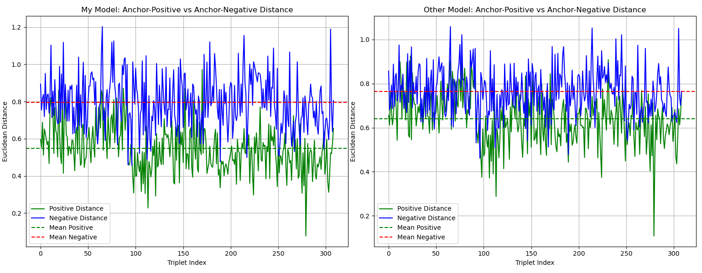

# Face-Recognition-For-Attendance-System

## 📺 Demo Video

You can watch the project demo here:

[Demo Video](https://drive.google.com/file/d/1Go0Z6ha2YooVh-sEB3TEQo0UwR7K3Tdq/view?usp=drive_link)

## Pretrained Model

The pretrained model (`model-v1.h5`) is available on Google Drive:

🔗 [Download here](https://drive.google.com/file/d/1oBigalkRvHei7WMu8zn9L5KqxWZdy0mr/view?usp=sharing)

After downloading, place the file in the following path:

## 🔍 Comparison: DeepFace VGG-Face vs Fine-Tuned VGG Model

To evaluate the performance of facial embeddings, we compare:

- ✅ **Pretrained VGG-Face model** from DeepFace  
- 🛠️ **Fine-tuned VGG model** trained specifically on our attendance dataset

### 🎯 Evaluation Metric

We use **euclidean distance** between facial embeddings:

- **Smaller distance** → images are more similar (same person)  
- **Larger distance** → images are different (different people)

### 📊 Result Overview

| Model              | Same Person (Avg. Distance) | Different People (Avg. Distance) |
|-------------------|-----------------------------|----------------------------------|
| DeepFace VGG-Face | 0.67                        | 0.78                             |
| Fine-Tuned VGG    | **0.56**                    | **0.8**                          |

🔎 As shown, the **fine-tuned model** produces **tighter clusters** for the same person and **larger separation** between different individuals.

### 🖼️ Visualization



*Figure: Comparison of cosine distances using pretrained DeepFace model vs. fine-tuned VGG.*
## 🚀 Get Started

1. **Tạo môi trường Conda từ file `environment.yml`**  
   ```bash
   conda env create -f environment.yml
   conda activate face-attendance
    ```
2. **Tải file weight của model**  
   - [Download model-v1.h5](https://drive.google.com/file/d/1oBigalkRvHei7WMu8zn9L5KqxWZdy0mr/view?usp=sharing)
   - Sau đó, cập nhật đường dẫn CHECKPOINT trong code trỏ tới file .h5 vừa tải.

3. **Cấu hình kết nối database**  
   Mở file `database.py` và chỉnh thông tin kết nối (host, user, password, database name) phù hợp với hệ thống của bạn.

4. **Chạy ứng dụng**  
   ```bash
    python app.py
    ```